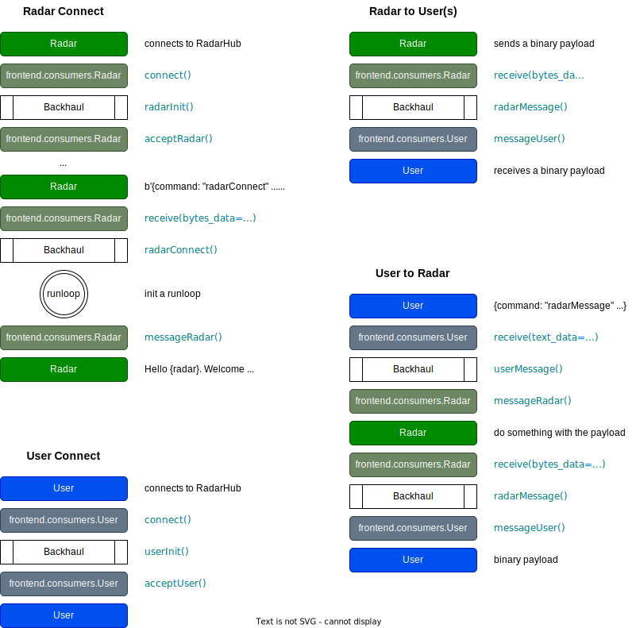

# RadarHub

This is a [Django]-[Channels] web interface for ARRC radar operations.

**IMPORTANT**: This is a work in progress. I just wanted to start the source control early.

Three main parts:

- [Django] backend
- [React] frontend
- [Python] backhaul

Some design constraints:

- Keep backend-frontend responsive, _only_ async functions
- All input/output gets picked up by backhaul
- Backhaul serves as the middle party to facilitate one-to-one or one-to-many messaging
- Payloads from a radar get broadcast to all users in a specific group by worker _backhaul_
- A radar reporter does not receive anything from the radar itself (different behavior than a chat room)

# (Evolving) Concept of Operations

Currently, the RadarHub is almost like a chat program with an exception that the messages are not echoed back. The radars do not recieve the payload they send home and the users do not see the command they issue. Everyone connects through the frontend websocket, either join as a radar (`frontend.consumers.Radar`) or join as a user (`frontend.consumers.User`). When a radar joins and sends in proper greeting, it receives a welcome message from the hub. When a user joins through a web browser, the frontend javascript main script ensures the connection is properly made, the user is assigned to a group, named after the radar name.

When a user request is issued, it is first received by the frontend, which checks for the required fields. If failed, nothing happens. Otherwise, it is routed to the backhaul asynchronously. Frontend immediately regain control, GUI should always be responsive. Backhaul decides which radar to send the request to, awaits for the radar response, and then routes it to the user.

When a radar joins the RadarHub, it reports its name. Backhaul launches a runloop to collect data streams from the radar. This runloop also sends whatever data stream available from the radar to the group. All users in that group receive the same data stream. This will change in the future for a more controlled fashion but kept simple at the moment for progressing towards the subsequent milestones.

## Milestones

- [x] 0.1 Can run
- [x] 0.2 Scope + Health working (7/21/2021)
- [x] 0.3 Some button actions to backhaul (7/29/2021)
- [x] 0.4 Migrate data module to an external websocket client (8/9/2021)
- [x] 0.5 3D view for radar products with map overlay (9/13/2021)
- [x] 0.6 SQLite / product catalog / products to 3D view (11/12/2021)
  - [x] 0.6.1 Removed most hard-wired parameters (1/7/2022)
  - [x] 0.6.2 Auto-select latest day, hour and file (1/15/2022)
  - [x] 0.6.3 Added support for multiple radars (1/30/2022)
  - [x] 0.6.4 Migrated to PostgreSQL (2/5/2022)
  - [x] 0.6.5 Refactored for a fresh run (2/10/2022)
  - [ ] 0.6.6 Updated database tooling (3/5/2022))
- [ ] 0.7 RadarKit communicates with RadarHub
- [ ] 0.8 Page template, UI materials, mobile version
- [ ] 0.9 Authentication + user priviledges
- [ ] 1.0 Landing page, radar selection, etc.

## Post Version 1.0

- [ ] GLView Upgrades
  - [ ] New abstraction layer for colorbar, title, and other static overlays.
  - [ ] Streaming buffers for radial-by-radial updates
  - [ ] New camera transformation that is radar centric
- [ ] Overlay Upgrades
  - [ ] An array of arrays of text assets to reduce texture updates
  - [ ] A new version of overlay.worker
- [ ] Caching
  - [ ] Frontend caching: archive.js
  - [ ] Backend caching: frontend.models.py
- [ ] Display frequency spectrum alongside scope view
- [ ] Show online users
- [ ] High-DPI support
- [ ] Cache sweeps using the LRU algorithm
- [ ] Let users download files
- [ ] Local/remote state

# A Few Important Things

Here are some assumptions that developers should be aware of.

## Data Types

Currently defined in `reporter/types.h`, which is arguably sub-optimal. Perhaps the project root folder is better. Will revisit.

In the C space, obviously you just include the header and you are done.

In the Python space, a parser is made to retrieve everythin in the C header to a Python enums through `reporter/enums.py`. All the types will be in the convention of

- `RadarHubType.Handshake`
- `RadarHubType.Control`
- `RadarHubType.Health`
- `RadarHubType.Scope`
- ...

In the Javascript space, the definition is passed to the frontend upon a successful connection, the data ingest `frontend/src/components/ingest.js` expects keys like `Control`, `Health`, `Scope`, etc., which nicely maps to the enum names in the C and Python spaces.

# Software Requirements

[Visual Studio Code](https://code.visualstudio.com) and the plugin Prettier are recommended but, of course, use whatever you prefer. Before setting the [Django] project, install some of the software.

## Node.js, npm, and PostgreSQL

On Ubuntu, run the following commands:

```shell
sudo apt update
sudo apt install nodejs npm libpq-dev postgresql
```

On macOS, run the following commands:

```shell
brew update
brew install nodejs npm libpq postgresql
```

Install the [Python] requirements as:

```shell
python -m pip install -r requirements.txt
```

Install [Node.js] and [npm] from NodeSource using the following commands:

```shell
curl -sL https://deb.nodesource.com/setup_14.x | sudo -E bash -
sudo apt install -y nodejs
```

## Getting the Project

Now you should be ready to clone the repository:

```shell
git clone https://git.arrc.ou.edu/radar/radarhub.git
```

Install the [Node.js] dependencies using [npm], which can be accomplished as:

```shell
cd frontend
npm install
```

## Configure PostgreSQL

Switch to user `postgres` and run `psql` using the following commands:

```shell
sudo -i -u postgres
psql
```

Create a database `radarhub`, and users `radarhub` and `guest` on [PostgreSQL]:

```text
postgres-# CREATE DATABASE radarhub;
postgres=#
postgres=# CREATE USER radarhub;
postgres-# ALTER ROLE radarhub WITH PASSWORD '_radarhub_password_';
postgres-# GRANT ALL PRIVILEGES ON DATABASE radarhub TO radarhub;
postgres-# ALTER DATABASE radarhub OWNER TO radarhub;
postgres=#
postgres=# CREATE USER guest;
postgres-# ALTER ROLE guest WITH PASSWORD '_guest_password_';
postgres-# GRANT CONNECT ON DATABASE radarhub TO guest;
postgres-# GRANT SELECT ON radarhub TO guest;
```

Also, configure [PostgreSQL] to be accessible through network by adding/modifying the following lines in the configuration file `/etc/postgresql/12/main/postgresql.conf`:

```conf
listen_addresses = '*'
```

Back to the [Django] project, create a plain text file named `db.conf` under the folder `config`, and put the following contents in there. Replace the `_radarhub_password_` you used in setting up the [PostgreSQL] database in the text.

```json
{ "host": "localhost", "user": "radarhub", "pass": "_radarhub_password_" }
```

The root folder of the radarhub project should look like this:

```shell
drwxrwxr-x 4 boonleng users 4.0K Oct  3 09:17 backhaul/
drwxrwxr-x 2 boonleng users 4.0K Feb  7 18:27 blob/
drwxrwxr-x 3 boonleng users 4.0K Feb  4 10:09 common/
drwxrwxr-x 2 boonleng users 4.0K Feb  8 11:03 config/
drwxrwxr-x 8 boonleng users 4.0K Feb  8 11:25 frontend/
drwxrwxr-x 3 boonleng users 4.0K Feb  8 11:18 radarhub/
drwxrwxr-x 4 boonleng users 4.0K Jan 23 10:19 reporter/
drwxrwxr-x 2 boonleng users 4.0K Jan  6 19:53 tools/
-rw-rw-r-- 1 boonleng users 1.9K Feb  8 11:18 dailylog.py
-rwxrwxr-x 1 boonleng users  23K Feb  8 11:18 dbtool.py*
-rwxrwxr-x 1 boonleng users 8.0K Feb  8 11:25 file2db.py*
-rwxrwxr-x 1 boonleng users  703 Oct  2 14:23 manage.py*
-rw-rw-r-- 1 boonleng users   87 Jan  7 17:36 package-lock.json
-rw-rw-r-- 1 boonleng users  12K Feb  8 11:19 README.md
-rw-rw-r-- 1 boonleng users  114 Feb  4 10:09 requirements.txt
-rwxrwxr-x 1 boonleng users  211 Oct  2 14:23 restart.sh*
-rwxrwxr-x 1 boonleng users  679 Oct  2 14:23 summary.sh*
-rwxrwxr-x 1 boonleng users  100 Oct  2 14:23 update.sh*
```

Now, you are ready to create the RadarHub default database

```shell
python manage.py makemigrations
python manage.py migrate
```

That's it, the project should be ready to go for more development or deployment.

## Some Useful SQL Commands

To login remotely, use:

```shell
psql -h localhost -U radarhub -W
psql -h dwv05 -U radarhub -W
```

Once in the `psql` terminal, some of these could be useful:

```sql
\d
\du
\dt
SELECT column_name, data_type, character_maximum_length FROM information_schema.columns WHERE table_name = 'frontend_file';
SELECT column_name, data_type, character_maximum_length FROM information_schema.columns WHERE table_name = 'frontend_day';
```

## Potential OS Limitations

If webpack display a message like this:

```text
Watchpack Error (watcher): Error: ENOSPC: System limit for number of file watchers reached
```

Add the following line to `/etc/sysctl.conf`

```conf
fs.inotify.max_user_watches=16384
```

Then, run

```shell
sudo sysctl -p
```

# Developing

Be sure to have [redis] going for the [Channels] module every time you reboot the machine.

```shell
docker run -p 6379:6379 -d redis:6
```

Run three terminals:

1. webpack

```shell
cd frontend
npm run dev
```

2. main django server

```shell
python manage.py runserver 0:8000
```

3. background worker

```shell
python manage.py runworker backhaul
```

Off you go, you should be able to view the RadarHub interface through a web browser at http://localhost:8000 and tinker with the source codes and see the changes when you reload the page. Happy coding.

# Deploying

On a production server, the Ubuntu [Nginx]-[Supervisor] setup was recommended in the [Channels] documentation. A special account `radarhub` has been created to house the production codes. The instructions here is based on the assumption that everything is stored under `/home/radarhub/app`. To make an optimized `main.js`, compile the components as:

```shell
cd frontend
npm run build
```

## Docker

The WebSocket component depends on [redis] through [docker]:

```shell
sudo docker run -d --restart unless-stopped -p 6379:6379 redis
```

which `redis:5` or `redis:6` can be used for a specific version if preferred.

## Nginx

Configure through the file `/etc/nginx/sites-available/radarhub` as:

```nginx
upstream channels-backend {
    server localhost:8000;
}

server {
    listen 443;
    server_name radarhub.arrc.ou.edu;
    rewrite ^(.*)? http://$host$1 permanent;
}

server {
    listen 80;
    listen [::]:80;
    server_name radarhub.arrc.ou.edu;

    location /static/ {
        root /home/radarhub/app/frontend;
    }

    location /favicon.ico {
        root /home/radarhub/app/frontend/static/images/favicon.ico;
    }

    location / {
        try_files $uri @proxy_to_app;
    }

    location @proxy_to_app {
        proxy_pass http://channels-backend;

        proxy_http_version 1.1;
        proxy_set_header Upgrade $http_upgrade;
        proxy_set_header Connection 'upgrade';
        proxy_set_header Host $host;
        proxy_set_header X-Real-IP $remote_addr;
        proxy_set_header X-Forwarded-For $proxy_add_x_forwarded_for;
        proxy_set_header X-Forwarded-Host $server_name;
    }
}
```

and enable it using shell command as:

```shell
ln -s /etc/nginx/sites-available/radarhub /etc/nginx/sites-enabled/
```

## Supervisor

Configure through the file `/etc/supervisor/conf.d/radarhub.conf` as:

```conf
[fcgi-program:radarhub.frontend]
user = radarhub
directory = /home/radarhub/app
environment = PYTHONUNBUFFERED=1
socket = tcp://localhost:8000
command = /home/radarhub/.pyenv/shims/python -m daphne -u /run/daphne/daphne%(process_num)d.sock --fd 0 --access-log - --proxy-headers radarhub.asgi:application
numprocs = 2
process_name = radarhub_%(process_num)d
autostart = true
autorestart = true
stdout_logfile = /home/radarhub/log/frontend.log
redirect_stderr = true
priority = 200

[program:radarhub.backhaul]
user = radarhub
directory = /home/radarhub/app
environment = PYTHONUNBUFFERED=1
command = /home/radarhub/.pyenv/shims/python /home/radarhub/app/manage.py runworker backhaul
autostart = true
autorestart = true
stdout_logfile = /home/radarhub/log/backhaul.log
redirect_stderr = true
priority = 100

[program:radarhub.dgen]
user = radarhub
command = /home/radarhub/app/reporter/dgen
autostart = true
autorestart = true
```

Create the run directory for socket

```shell
sudo mkdir /run/daphne
sudo chown radarhub.radarhub /run/daphne/
```

Configure the file to be created at each boot through `/usr/lib/tmpfiles.d/daphne.conf` as:

```conf
d /run/daphne 0755 radarhub radarhub
```

Start the service as:

```shell
sudo supervisorctl reread
sudo supervisorctl update
sudo supervisorctl start all
```

A convenient script `restart.sh` is included to restart all services in a proper sequence in order to prevent channels getting full.

## Systemd

Modify `/etc/systemd/system/multi-user.target.wants/supervisor.service` by adding the following line to the section `[Unit]`.

```
Requires=docker.service
```

# Frontend Block Diagram


# Backend Block Diagram


# Sequence of Events

`frontend.consumers.User`
- message from web UI is always in text form (JSON)
- message to web UI is always in binary form (bytearray)

`frontend.consumers.Radar`
- message from radar is always in binary form ([type][payload])
- message to radar is always in text form (plain text)




[channels]: https://channels.readthedocs.io
[django]: https://www.djangoproject.com
[docker]: https://www.docker.com
[node.js]: https://nodejs.org
[npm]: https://www.npmjs.com
[nginx]: https://www.nginx.com
[python]: https://www.python.org
[react]: https://reactjs.org
[redis]: https://redis.io
[supervisor]: http://supervisord.org
[postgresql]: https://www.postgresql.org
